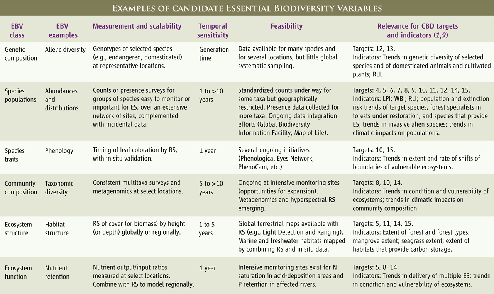

```{r setup, include=FALSE}
knitr::opts_chunk$set(echo = TRUE)
```

## Pereira et al. (2013) Science

**EBV définition:**  

Mesure requise pour l'étude, le reportage, et la gestion des changements de biodiversité.  
  
  
**But principal des EBVs:**  

Former un système global de suivi de la biodiversité pour capturer les dimensions majeurs des changements de biovdiversité pour informer les scientifiques et les décideurs.  
  
  
**Motivation des EBVs dans un sens plus général:**  

Au lieu de mettre tous nos efforts dans la description d'espèces qui restent à découvrir, on devrait faire un échantillonage répété des mêmes variables avec les mêmes protocoles (si possible) pour plusieurs taxons, sites, et points dans le temps.
  
  
**En gros, les EBVs servent à:**  
1. cibler un minimum de variables essentiels à mesurer 
2. standardiser la mesure de ces variables (protocoles harmonisés!)
3. faciliter l'intégration de données brutes vers des indicateurs  

e.g. du point #3
donnée brute = abondances d'une population
EBV = abondances de populations pour un groupe d'espèces dans un site
indicateur = LPI, indicateur aggregé d'une tendance moyenne des populations de plusieurs espèces et sites  
  
  
Les EBVs sont choisis surtout pour optimiser:     

* flexibilité (différentes échelles spatialles/temporelles) [*scalability*] 
* sensibilité aux changements temporels 
* faisabilité 
* pertinence 
* généralité (taxons, et aussi systèmes terrestre/marin/eau douce) 

{width=600px}


## EBVs pertinents pour Atlas 

Le but d'Atlas c'est de rassembler les données brutes et les rendre utilisables (cleaning), harmonisés avec les autres bases de données utilisés par les EBVs (ontologie), modélisés pour produire des cartes de distribution, pour ensuite calculer des indicateurs de changement de biodiversité (Fig. 1 dans Kissling).


| EBV class | Exemple d'EBV | Indicateurs |
|-----------|---------------|-------------|
| populations | abondance et/ou distribution de populations | Living Planet Index, Wild Bird Index, Redlist Index, etc. |
| traits | phénologie | shifts in timing of ecosystems |
| composition des communautés | diversité taxonomique | changements de composition des communautés |


Fig. 1 & 3 in Kissling is also useful

